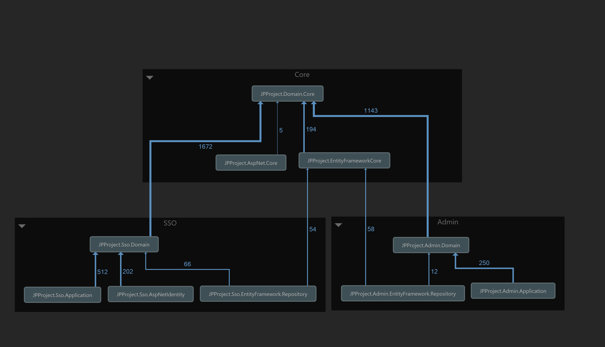

Architecture
============

This project was developed aiming the best practices. 

Equinox Project
---------------
The ASP.NET Core Architecture was based on `Equinox Project <https://github.com/EduardoPires/EquinoxProject/>`_. 

Angular 8
---------

Admin UI and User management was built with Angular 8.

Technologies
-------------

Check below how it was developed.

Written in ASP.NET Core and Angular 8.

- Angular 8
- Rich UI interface
- ASP.NET Core 3.1
- ASP.NET MVC Core 
- ASP.NET WebApi Core
- ASP.NET Identity Core
- Argon2 Password Hashing
- MySql Ready
- Sql Ready
- Postgree Ready
- SQLite Ready
- Entity Framework Core
- .NET Core Native DI
- AutoMapper
- FluentValidator
- MediatR
- Swagger UI
- High customizable
- Translation for 7 different languages

Architecture
^^^^^^^^^^^^

- Architecture with responsibility separation concerns, SOLID and Clean Code
- Domain Driven Design (Layers and Domain Model Pattern)
- Domain Events
- Domain Notification
- CQRS (Imediate Consistency)
- Event Sourcing
- Unit of Work
- Repository and Generic Repository

